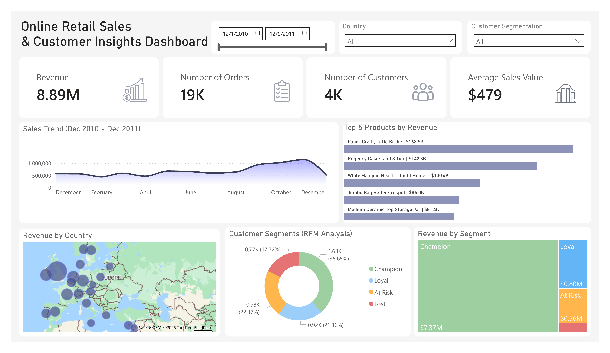

# Online Retail Sales & Customer Segmentation Dashboard

## Project Overview

This project analyzes online retail transaction data to uncover business insights and segment customers using RFM (Recency, Frequency, Monetary) analysis.

The goal is to identify high-value customers, understand purchasing behavior, and support data-driven decision making.

---

## Data Source

The dataset used in this project is the Online Retail dataset sourced from Kaggle.

It contains transactional data for an online retail company, including invoices, products, quantities, and customer information.

---

Dashboard Preview



---


## Tools & Technologies

* Python (Pandas, NumPy, re, datetime)
* Jupyter Notebook
* Power BI
* DAX (Data Analysis Expressions for KPI calculations)


---

## Customer Segmentation (RFM)

* Champions: high-value and frequent customers
* Loyal Customers: consistent buyers
* At Risk: declining engagement
* Lost Customers: inactive customers

---

## Key Insights

* Champions contribute the majority of revenue
* A portion of customers are at risk of churn
* Sales trends show seasonal patterns
* A small number of products drive a large share of revenue

---

## Project Structure

```
online-retail-rfm-dashboard/
│
├── dashboard/
├── notebooks/
├── images/
└── README.md
```

## Author

Maha
